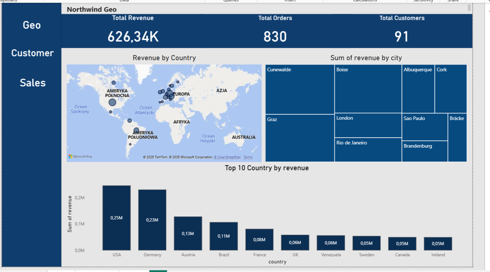

# Northwind Sales Dashboard | Power BI | Continuous Improvement

## Project Overview

This project analyzes sales data from the **Northwind** database using **SQL (PostgreSQL)** and **Power BI**.

The goal of the analysis is to identify:

* top customers
* best-selling products
* revenue trends
* geographical distribution of sales

The project demonstrates the full analytics workflow:
data extraction → SQL analysis → visualization in Power BI.

---

Power BI dashboard built on Northwind database.

## 🚧 Project Status
This dashboard is actively being improved:
- Adding advanced DAX measures
- Improving customer segmentation
- Enhancing UX and interactivity

## Pages
- Geo Dashboard — revenue by country and city (map, treemap, bar chart)
- Sales -
- Customers -

## KPIs
- Total Revenue: 626K
- Total Orders: 830
- Total Customers: 91


images/
    screenshot.png

powerbi/
    northwind.pbix

sql/
    north.sql

README.md


## Data
Northwind sample database

## Tools

* PostgreSQL
* SQL
* Power BI

---

## Key Metrics

* Total Revenue
* Top 10 Customers by Revenue
* Top 5 Products by Revenue
* Monthly Sales Trend
* Revenue by Country

---

## Dashboard Preview



---

## Example SQL Query

```sql
SELECT 
    c.company_name,
    SUM(od.quantity * od.unit_price * (1 - od.discount)) AS revenue
FROM customers c
JOIN orders o 
    ON c.customer_id = o.customer_id
JOIN order_details od 
    ON o.order_id = od.order_id
GROUP BY c.company_name
ORDER BY revenue DESC;
```

---

## Project Structure

```
northwind-sales-dashboard

images/
    screenshot1.png
    screenshot2.png
    screenshot3.png

powerbi/
    northwinddash.pbix

sql/
    northwind_queries.sql
    northgeo.sql
    northsales.sql
README.md
```

---

## Key Insights

* A small number of customers generate the majority of total revenue.
* A few products dominate overall sales.
* Sales are concentrated in several key countries.

---

## Author

Oleksii Fandieiev

